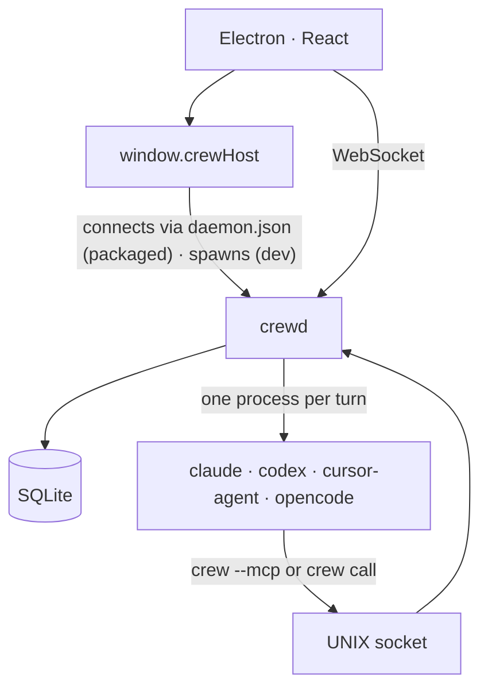
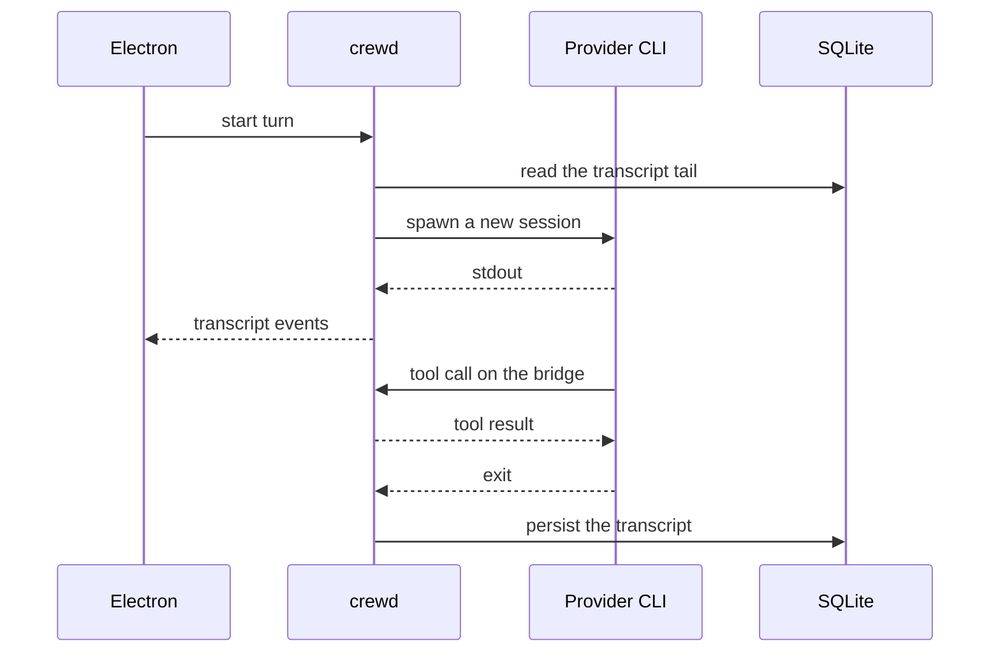
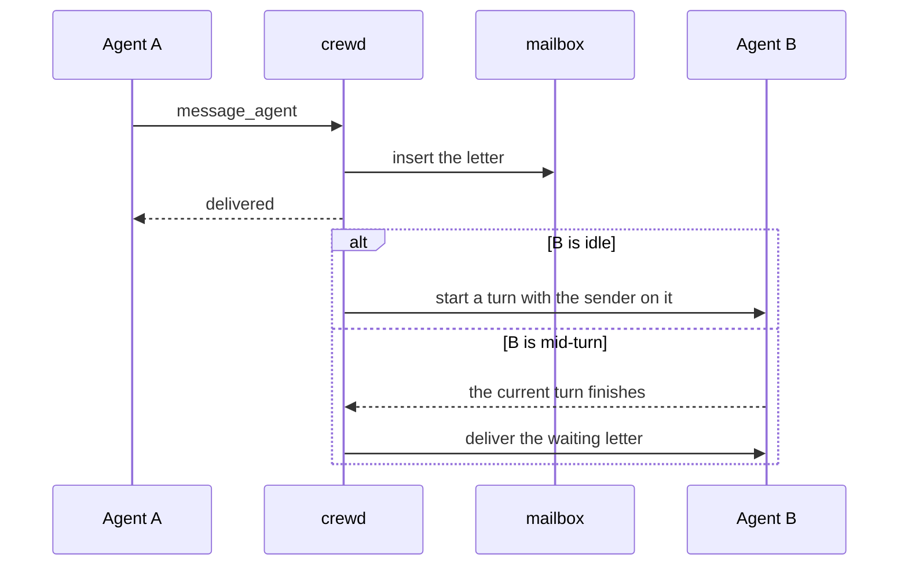

# Architecture

Crew is two processes. Electron is the window. `crewd` is the daemon: it holds the agents, the terminals, the processes, the transcripts, and a SQLite file. The window is a client of the daemon. In the packaged app `crewd` is a LaunchAgent: closing the window leaves it running, with everything it started, and **Crew › Quit Crew and Stop Everything** stops it. In dev it is the window's child and stops with it.



```
electron/          the window; connects to crewd, or spawns it in dev
src/               the React client
crates/crewd/      the daemon process
crates/crew-cli/   the `crew` command line
crates/crew-core/  turns, store, providers, tools
crates/crew-protocol/  the messages, defined once
```

`crew-protocol` generates `src/lib/protocol.ts`. A message is defined once.

## Where `crewd` runs

**Packaged.** `crewd` runs as the LaunchAgent `rogazth.crew.crewd`, whose plist (`<data-dir>/rogazth.crew.crewd.plist`) points at the `crewd` inside the bundle with `--data-dir <userData> --supervised-by launchd` and logs to `<data-dir>/crewd.log`. `crew daemon install` writes the plist (`crates/crew-cli/src/launch_agent.rs`); the app runs that command from its bundle whenever the plist is missing or names another `crewd` or data dir, which is how a moved or replaced app takes over. `KeepAlive { SuccessfulExit: false }`: a crash brings `crewd` back, a clean stop (SIGTERM, `daemon_shutdown`) exits 0 and leaves it down. There is no `RunAtLoad`, and the plist stays out of `~/Library/LaunchAgents` because `SuccessfulExit` implies it (launchd.plist(5)) and login would load it: `crewd` runs only once Crew, or `crew daemon install|restart`, bootstraps and kickstarts it, and after a logout or reboot it stays down until Crew opens. Under launchd, `crewd` prints no handshake and does not watch stdin.

`crewd` listens for SIGTERM, SIGINT and SIGHUP before it does anything else, so a signal during startup ends in the usual cleanup and exit 0. A `crewd` that finds another one answering on the data dir's `crew.sock` leaves it alone and exits; it only replaces a socket nobody answers on. How a failed start exits is chosen for its supervisor: the app's child exits 1 and the app says why; under launchd a permanent failure (a data dir it cannot use, a database it cannot open or migrate, another daemon on the data dir) is logged and exits 0, because exit 1 would have launchd start it again every ten seconds for the rest of the session. A transient one (the WebSocket or the bridge not binding) exits 1 for launchd to retry, up to five in a row (counted in `<data-dir>/crewd.failed-starts`), then it too exits 0. The app sees no daemon come up, falls back to the child, and the child fails the same way where the app shows it. Every five minutes, and at startup, `crewd` keeps `crewd.log` at 0600 and, past 10 MB, copies its last megabyte to `crewd.log.1` and empties it in place: launchd holds an appending descriptor, which a rename would carry off with the old file.

On launch the app reads `daemon.json` and asks the bridge `whoami` with the user token (`electron/daemon-agent.ts`, decisions in `daemon-agent-plan.ts`). The plist is compared with the bundle through `realpath` on both sides, since `crew daemon install` writes the `crewd` it resolved. A daemon that answers with the app's version is used. No file, or one whose pid is dead, gets `launchctl bootstrap` if the agent is not loaded (it never is after a reboot) and then `kickstart`; the stale file is left for `crewd`, which renames its own over it. One that is alive but silent gets `kickstart -k`; one of another version, after an update, is asked to exit (`daemon/shutdown`, so auto-start processes come back) and started again. That replacement happens only on launch, right after the plist was made to name this bundle's `crewd`. While the window is open it checks every two seconds: a new daemon (launchd's restart, `crew daemon restart`) is switched to and the window reloads; a missing one is started again; one of another version is left alone with a single notification to reopen Crew, since replacing it would only have launchd run the same `crewd` again. A quit, plain or stopping everything, stops the watchdog, and a check already in flight gives up before it reaches launchctl. The window and the browser host read the address on every reconnect, so a new port and token reach both. Quitting only lets go. If the agent cannot be installed, loaded or reached within 20 s, the app boots it out (so no second daemon shares the data dir) and runs `crewd` as its child for that launch, as in dev, with a notification that processes stop when Crew quits; the error dialog is only for when that fails too. A Crew that macOS runs from App Translocation (a quarantined app opened where it was downloaded) never installs the agent, whose path would be gone next launch: it runs the child and asks the user to move Crew to Applications. One Crew runs per data dir (`requestSingleInstanceLock`); a second one focuses the first.

**Dev** (`npm run app`, worktrees with their own `CREW_DATA_DIR`). Electron spawns `crewd --data-dir <userData>`, reads the handshake line on stdout, and `crewd` exits when its stdin closes or on a signal. A daemon that dies is started once more, or again if it had been up over a minute.

`daemon_shutdown` over the WebSocket, and `daemon/shutdown` on the bridge for the user's token only, ask `crewd` to stop exactly as a signal would: it removes `daemon.json`, gives supervised processes one stop grace and exits 0.

## A turn

A turn is one run of the provider CLI. It starts a clean session. The daemon hands it the tail of the conversation, streams the output back to the window, and writes the transcript when the process exits.



Each provider is a module under `crates/crew-core/src/providers/`. It knows how to spawn that CLI and how to read its stream.

## Agents writing to each other

An agent leaves a letter. The daemon delivers it as a turn on the other agent, with the sender on it. If that agent is busy, the letter waits until the current turn ends.



Claude, Codex, and opencode reach Crew through an MCP server (`crewd --mcp`). Cursor reaches the same bridge by running `crewd call` in the shell.

## Who is calling

The bridge is a UNIX socket in the data dir. Every request carries a token, and the token alone says who is calling (`crates/crew-core/src/caller.rs`):

- **An agent.** A token per session, minted when a turn starts and retired by the next one.
- **A terminal session.** `pty_spawn` with `session` has the daemon complete the argv the window built: the provider's MCP flag (Claude's `--mcp-config` is added to the user's own servers, not in place of them) and `CREW_SOCKET`/`CREW_TOKEN` in the environment. The token belongs to that one process and is handed back when it is reaped. A terminal has no turns, so it is not offered `continue_after_turn`, and a letter it sends tells the agent that no reply can reach it.
- **The user.** `<data-dir>/daemon.json` (0600) holds the WebSocket `url` and `token`, the bridge `socket`, a `userToken` and the `version`. It is written when the daemon starts and removed when it stops cleanly. A call with the user token names its workspace with `workspace`, an id or a path inside it. This is what the `crew` CLI reads.

This is policy, not isolation. Every process Crew starts, agents and terminals included, runs as the user's UID and can read `daemon.json`, whose `userToken` speaks as the user (no process approval, `daemon/shutdown`) and whose WebSocket `token` has every power the window has. The 0600 mode keeps it from other users, not from sessions. What keeps a session to its own identity is that the tools it is handed use its own token: `crew` inside a session never falls back to `daemon.json`, and a process that goes and reads the file itself is not stopped.

`tools/list`, `find_tool` and every tool answer according to the caller. The `initialize` of `crewd --mcp` carries `instructions` naming the caller's tools, so a terminal session learns them without Crew touching its prompt. A family of tools that lives in its own module implements `ToolFamily` and is registered on the `Toolbox` in `crewd::serve`.

## The `crew` command

`crew` (`crates/crew-cli`) is a client of the same bridge. Inside a session (`CREW_SOCKET` or `CREW_TOKEN` set) it takes them and is that session: `--data-dir` does not change that, half a session is refused rather than taken for the user, and `crew daemon` is refused outright, since the daemon runs every session. Only `--as-user`, meant for a human typing at a Crew terminal, makes it the user there. Anywhere else it reads `daemon.json` from `--data-dir`, `$CREW_DATA_DIR` or the installed app's folder, and speaks as the user in the workspace holding the current directory. Its commands are thin wrappers over tools (`crew ps` is `list_processes`, `crew agents` is `list_agents`), and `crew call` reaches any tool by name, so the CLI and MCP cannot drift apart. The bridge answers two methods for it beside `tools/*`: `tools/catalog`, every tool the caller may run, listed or not, for `crew call --help`; and `whoami`, for `crew status`. `crew mcp` is the stdio server; `crewd --mcp` and `crewd call` stay one version as aliases. The app bundles `crew` next to `crewd`, and **Crew › Install `crew` Command…** links it onto the user's PATH. When the LaunchAgent serves the data dir, `crew daemon stop` asks for `daemon/shutdown`, `restart` is `launchctl kickstart -k` and `status` adds what `launchctl print` says; otherwise they go through the pid in `daemon.json`. `crew daemon install|uninstall` write or remove the plist and bootstrap or boot it out.
