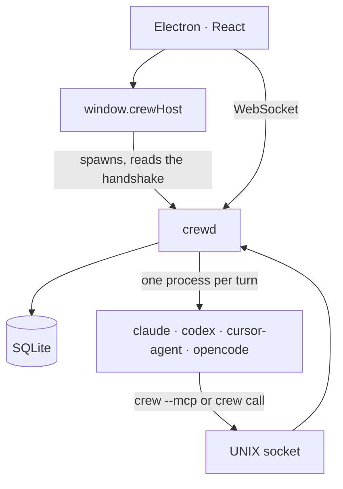
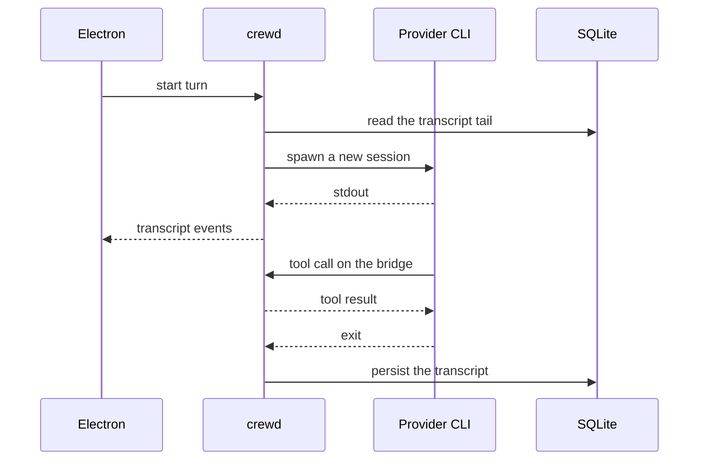
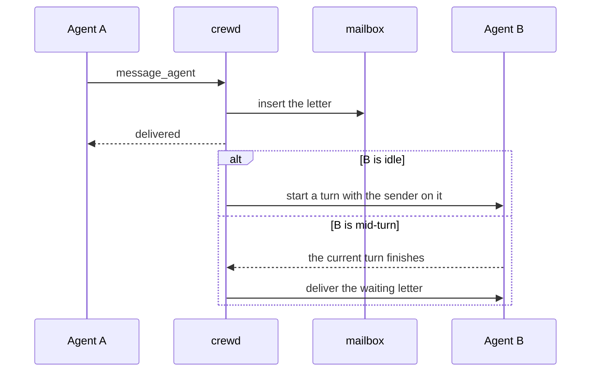

# Architecture

Crew is two processes. Electron is the window. `crewd` is the daemon: it holds the agents, the transcripts, and a SQLite file. The window is a client of the daemon. Closing it stops the daemon and the child processes the daemon started.



```
electron/          the window; spawns crewd
src/               the React client
crates/crewd/      the daemon process
crates/crew-core/  turns, store, providers, tools
crates/crew-protocol/  the messages, defined once
```

`crew-protocol` generates `src/lib/protocol.ts`. A message is defined once.

## A turn

A turn is one run of the provider CLI. It starts a clean session. The daemon hands it the tail of the conversation, streams the output back to the window, and writes the transcript when the process exits.



Each provider is a module under `crates/crew-core/src/providers/`. It knows how to spawn that CLI and how to read its stream.

## Agents writing to each other

An agent leaves a letter. The daemon delivers it as a turn on the other agent, with the sender on it. If that agent is busy, the letter waits until the current turn ends.



Claude, Codex, and opencode reach Crew through an MCP server (`crewd --mcp`). Cursor reaches the same bridge by running `crewd call` in the shell.

## Who is calling

The bridge is a UNIX socket in the data dir. Every request carries a token, and the token alone says who is calling (`crates/crew-core/src/caller.rs`):

- **An agent.** A token per session, minted when a turn starts and retired by the next one.
- **A terminal session.** `pty_spawn` with `session` has the daemon complete the argv the window built: the provider's MCP flag (Claude's `--mcp-config` is added to the user's own servers, not in place of them) and `CREW_SOCKET`/`CREW_TOKEN` in the environment. The token belongs to that one process and is handed back when it is reaped. A terminal has no turns, so it is not offered `continue_after_turn`, and a letter it sends tells the agent that no reply can reach it.
- **The user.** `<data-dir>/daemon.json` (0600) holds the WebSocket `url` and `token`, the bridge `socket`, a `userToken` and the `version`. It is written when the daemon starts and removed when it stops cleanly. A call with the user token names its workspace with `workspace`, an id or a path inside it. This is what the `crew` CLI reads.

`tools/list`, `find_tool` and every tool answer according to the caller. The `initialize` of `crewd --mcp` carries `instructions` naming the caller's tools, so a terminal session learns them without Crew touching its prompt. A family of tools that lives in its own module implements `ToolFamily` and is registered on the `Toolbox` in `crewd::serve`.
