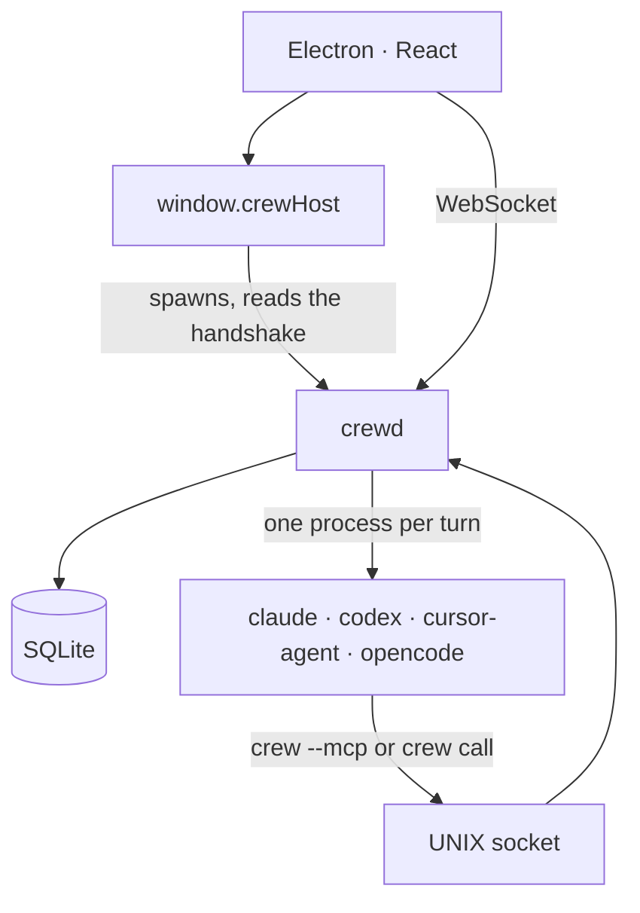
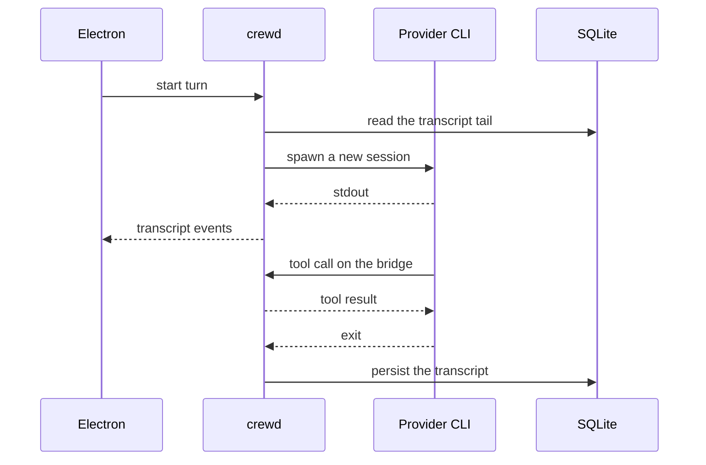
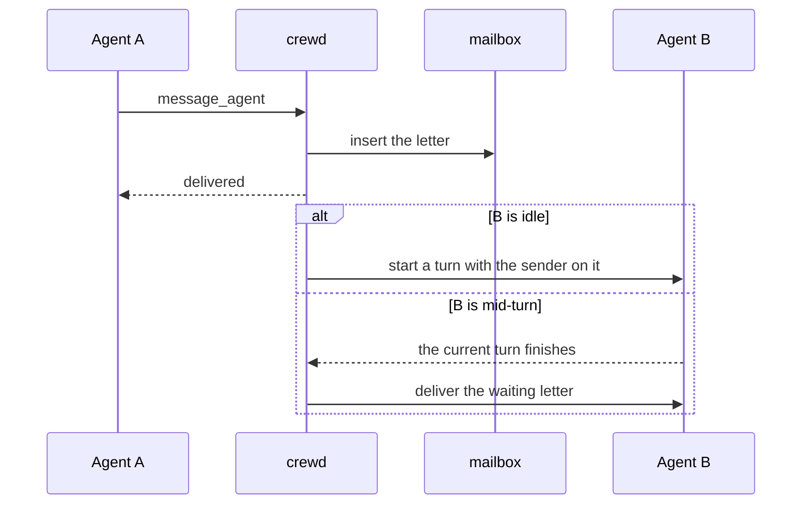

# Architecture

Crew is two processes. Electron is the window. `crewd` is the daemon: it holds the agents, the transcripts, and a SQLite file. The window is a client of the daemon. Closing it stops the daemon and the child processes the daemon started.


```mermaid
flowchart TB
  UI["Electron · React"]
  Host["window.crewHost"]
  Daemon["crewd"]
  Store[("SQLite")]
  CLI["claude · codex · cursor-agent · opencode"]
  Bridge["UNIX socket"]

  UI --> Host
  Host -->|"spawns, reads the handshake"| Daemon
  UI -->|"WebSocket"| Daemon
  Daemon --> Store
  Daemon -->|"one process per turn"| CLI
  CLI -->|"crew --mcp or crew call"| Bridge
  Bridge --> Daemon
```

```
electron/          the window; spawns crewd
src/               the React client
crates/crewd/      the daemon process
crates/crew-core/  turns, store, providers, tools
crates/crew-protocol/  the messages, defined once
```

`crew-protocol` generates `src/lib/protocol.ts`. A message is defined once.

## A turn

A turn is one run of the provider CLI. It starts a clean session. The daemon hands it the tail of the conversation, streams the output back to the window, and writes the transcript when the process exits.


```mermaid
sequenceDiagram
  participant UI as Electron
  participant D as crewd
  participant CLI as Provider CLI
  participant DB as SQLite

  UI->>D: start turn
  D->>DB: read the transcript tail
  D->>CLI: spawn a new session
  CLI-->>D: stdout
  D-->>UI: transcript events
  CLI->>D: tool call on the bridge
  D-->>CLI: tool result
  CLI-->>D: exit
  D->>DB: persist the transcript
```

Each provider is a module under `crates/crew-core/src/providers/`. It knows how to spawn that CLI and how to read its stream.

## Agents writing to each other

An agent leaves a letter. The daemon delivers it as a turn on the other agent, with the sender on it. If that agent is busy, the letter waits until the current turn ends.


```mermaid
sequenceDiagram
  participant A as Agent A
  participant D as crewd
  participant M as mailbox
  participant B as Agent B

  A->>D: message_agent
  D->>M: insert the letter
  D-->>A: delivered
  alt B is idle
    D->>B: start a turn with the sender on it
  else B is mid-turn
    B-->>D: the current turn finishes
    D->>B: deliver the waiting letter
  end
```

Claude, Codex, and opencode reach Crew through an MCP server (`crewd --mcp`). Cursor reaches the same bridge by running `crewd call` in the shell.

## A machine that is not this Mac

The window keeps one connection per daemon, and a call goes to the daemon that owns its workspace, session, or path (`src/lib/client/route.ts`). A connection is online once the daemon says hello; a remote that does not answer is offline in a few seconds, and its workspaces stay on the rail from the last list it gave. This Mac's daemon stores the address book (`remote_list`) and every preference. The token that opens a remote daemon stays in the keychain, not in that database. Workspaces, sessions, files, and terminals follow the daemon that owns them. Routines armed on a remote daemon keep firing when the Mac is asleep or off, because the scheduler lives in `crewd`.

`crewd serve` listens on the machine's Tailscale address. The Mac installs that binary over SSH, as a systemd user service, and pairs with the token the daemon writes under `~/.crew`. Removing a machine stops the service. `~/.crew` stays unless the confirm says to delete it. Linger is left as it was.

A remote workspace's browser reaches `localhost` on that machine through a SOCKS5 proxy on the next port. The proxy only connects to loopback, and the page session only sends localhost through it. An agent taking over the Mac's browser is a separate change.
