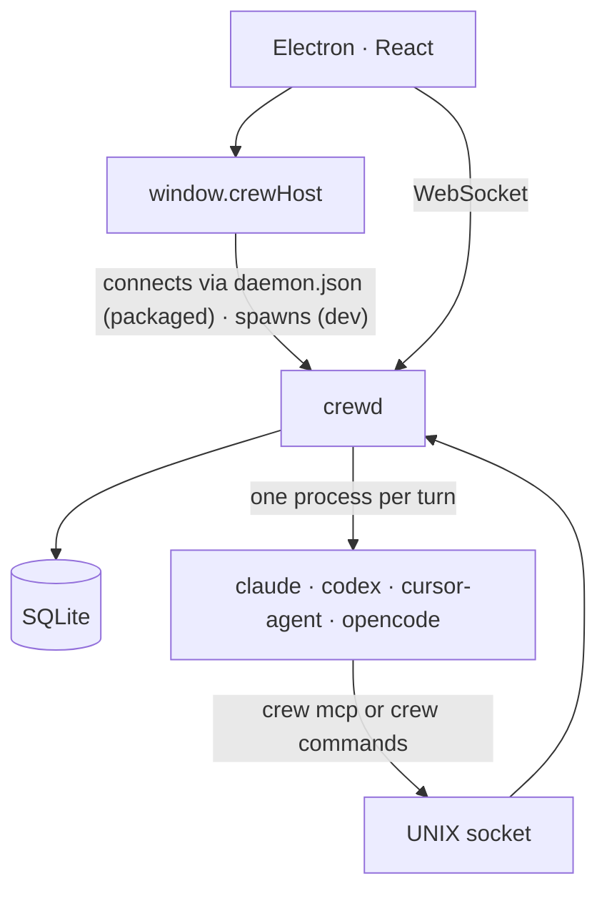
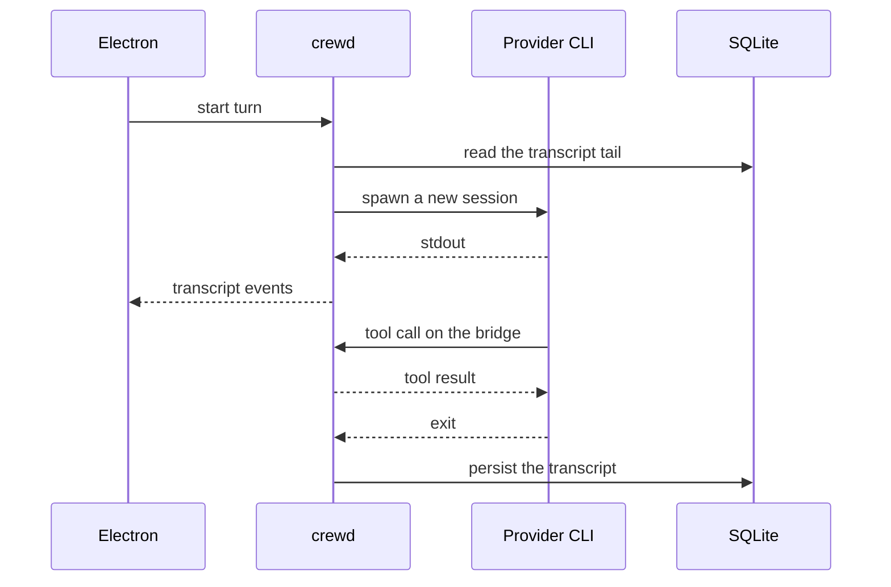
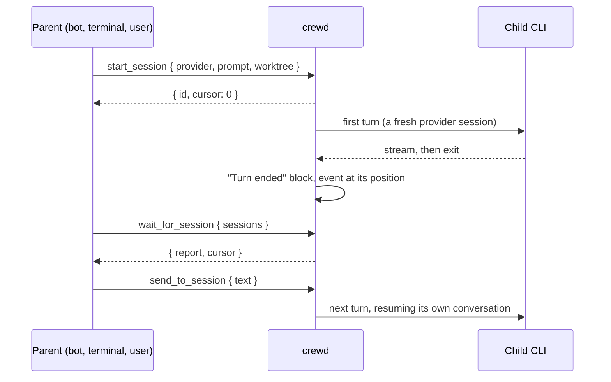

# Architecture

## The words

Models have confused these before, so they are said the same way everywhere a model reads them: here, the MCP `instructions()` and every session tool's description.

- **Bot** — a persistent identity Crew owns: a name, a description, an autonomy, a mailbox and a history. It lives in the `bots` table. `message_agent` reaches it. ("Agent" is not a Crew noun: in the industry's sense, a model plus its harness, it is what Crew calls a session.)
- **Session** — one provider CLI (claude, codex, opencode, cursor) running a conversation. It lives in the `sessions` table and belongs to a bot (the session its turns run in, under the bot's own id), to whoever started it with `start_session` (a *child*), or to nobody (a *terminal* the user drives).

A bot outlives its sessions; a session is one provider CLI process and can be thrown away.

Crew is two processes. Electron is the window. `crewd` is the daemon: it holds the bots, the terminals, the processes, the transcripts, and a SQLite file. The window is a client of the daemon. In the packaged app `crewd` is a LaunchAgent: closing the window leaves it running, with everything it started, and **Crew › Quit Crew and Stop Everything** stops it. In dev it is the window's child and stops with it.


```mermaid
flowchart TB
  UI["Electron · React"]
  Host["window.crewHost"]
  Daemon["crewd"]
  Store[("SQLite")]
  CLI["claude · codex · cursor-agent · opencode"]
  Bridge["UNIX socket"]

  UI --> Host
  Host -->|"connects via daemon.json (packaged) · spawns (dev)"| Daemon
  UI -->|"WebSocket"| Daemon
  Daemon --> Store
  Daemon -->|"one process per turn"| CLI
  CLI -->|"crew mcp or crew commands"| Bridge
  Bridge --> Daemon
```

```
electron/          the window; connects to crewd, or spawns it in dev
src/               the React client
crates/crewd/      the daemon process
crates/crew-cli/   the `crew` command line
crates/crew-core/  turns, store, providers, tools
crates/crew-protocol/  the messages, defined once
```

`crew-protocol` generates `src/lib/protocol.ts`. A message is defined once.

## Where `crewd` runs

**Packaged.** `crewd` runs as the LaunchAgent `rogazth.crew.crewd`, whose plist (`<data-dir>/rogazth.crew.crewd.plist`) points at the `crewd` inside the bundle with `--data-dir <userData> --supervised-by launchd` and logs to `<data-dir>/crewd.log`. `crew daemon install` writes the plist (`crates/crew-cli/src/launch_agent.rs`); the app runs that command from its bundle whenever the plist is missing or names another `crewd` or data dir, which is how a moved or replaced app takes over. `KeepAlive { SuccessfulExit: false }`: a crash brings `crewd` back, a clean stop (SIGTERM, `daemon_shutdown`) exits 0 and leaves it down. There is no `RunAtLoad`, and the plist stays out of `~/Library/LaunchAgents` because `SuccessfulExit` implies it (launchd.plist(5)) and login would load it: `crewd` runs only once Crew, or `crew daemon install|restart`, bootstraps and kickstarts it, and after a logout or reboot it stays down until Crew opens. Under launchd, `crewd` prints no handshake and does not watch stdin.

`crewd` listens for SIGTERM, SIGINT and SIGHUP before it does anything else, so a signal during startup ends in the usual cleanup and exit 0. A `crewd` that finds another one answering on the data dir's `crew.sock` leaves it alone and exits; it only replaces a socket nobody answers on. How a failed start exits is chosen for its supervisor: the app's child exits 1 and the app says why; under launchd a permanent failure (a data dir it cannot use, a database it cannot open or migrate, another daemon on the data dir) is logged and exits 0, because exit 1 would have launchd start it again every ten seconds for the rest of the session. A transient one (the WebSocket or the bridge not binding) exits 1 for launchd to retry, up to five in a row (counted in `<data-dir>/crewd.failed-starts`), then it too exits 0. The app sees no daemon come up, falls back to the child, and the child fails the same way where the app shows it. Every five minutes, and at startup, `crewd` keeps `crewd.log` at 0600 and, past 10 MB, copies its last megabyte to `crewd.log.1` and empties it in place: launchd holds an appending descriptor, which a rename would carry off with the old file.

On launch the app reads `daemon.json` and asks the bridge `whoami` with the user token (`electron/daemon-agent.ts`, decisions in `daemon-agent-plan.ts`). The plist is compared with the bundle through `realpath` on both sides, since `crew daemon install` writes the `crewd` it resolved. A daemon that answers with the app's version is used. No file, or one whose pid is dead, gets `launchctl bootstrap` if the agent is not loaded (it never is after a reboot) and then `kickstart`; the stale file is left for `crewd`, which renames its own over it. One that is alive but silent gets `kickstart -k`; one of another version, after an update, is asked to exit (`daemon/shutdown`, so its processes stop the usual way) and started again. That replacement happens only on launch, right after the plist was made to name this bundle's `crewd`. While the window is open it checks every two seconds: a new daemon (launchd's restart, `crew daemon restart`) is switched to and the window reloads; a missing one is started again; one of another version is left alone with a single notification to reopen Crew, since replacing it would only have launchd run the same `crewd` again. A quit, plain or stopping everything, stops the watchdog, and a check already in flight gives up before it reaches launchctl. The window and the browser host read the address on every reconnect, so a new port and token reach both. Quitting only lets go. If the agent cannot be installed, loaded or reached within 20 s, the app boots it out (so no second daemon shares the data dir) and runs `crewd` as its child for that launch, as in dev, with a notification that processes stop when Crew quits; the error dialog is only for when that fails too. A Crew that macOS runs from App Translocation (a quarantined app opened where it was downloaded) never installs the agent, whose path would be gone next launch: it runs the child and asks the user to move Crew to Applications. One Crew runs per data dir (`requestSingleInstanceLock`); a second one focuses the first.

**Dev** (`npm run app`, worktrees with their own `CREW_DATA_DIR`). Electron spawns `crewd --data-dir <userData>`, reads the handshake line on stdout, and `crewd` exits when its stdin closes or on a signal. A daemon that dies is started once more, or again if it had been up over a minute.

`daemon_shutdown` over the WebSocket, and `daemon/shutdown` on the bridge for the user's token only, ask `crewd` to stop exactly as a signal would: it removes `daemon.json`, gives supervised processes one stop grace and exits 0.

## A turn

A turn is one run of the provider CLI. A bot's turn starts a clean provider session; the daemon hands it the tail of the conversation, streams the output back to the window, and writes the transcript when the process exits. A child's turn resumes its own provider session instead (see below).


```mermaid
sequenceDiagram
  participant UI as Electron
  participant D as crewd
  participant CLI as Provider CLI
  participant DB as SQLite

  UI->>D: start turn
  D->>DB: read the transcript tail
  D->>CLI: spawn a new session
  CLI-->>D: stdout
  D-->>UI: transcript events
  CLI->>D: tool call on the bridge
  D-->>CLI: tool result
  CLI-->>D: exit
  D->>DB: persist the transcript
```

Each provider is a module under `crates/crew-core/src/providers/`. It knows how to spawn that CLI and how to read its stream.

## Sessions a caller starts

Any bot, terminal or the user can hand a job to another provider CLI and get its answer back, without that CLI needing a tool to answer: its last message of each turn is its report. The parent starts it, waits on it and reads what it did, the same moves as a dev server's `start_process`, `wait_for_log` and `read_logs`.


```mermaid
sequenceDiagram
  participant P as Parent (bot, terminal, user)
  participant D as crewd
  participant C as Child CLI

  P->>D: start_session { provider, prompt, worktree }
  D-->>P: { id, cursor: 0 }
  D->>C: first turn (a fresh provider session)
  C-->>D: stream, then exit
  D->>D: "Turn ended" block, event at its position
  P->>D: wait_for_session { sessions }
  D-->>P: { report, cursor }
  P->>D: send_to_session { text }
  D->>C: next turn, resuming its own conversation
```

A child is driven by the same `TurnHost` a bot is, with three differences (`crates/crew-core/src/session_tools.rs`, `turns.rs`): it resumes its provider's conversation (`claude --resume`, `codex exec resume`, `opencode run --session`, `cursor-agent --resume`) where a bot is handed the tail; its persona is the envelope — who started it, and that its final message is its report; and the end of each of its turns is an event. Every event appends a block to its transcript, so the event's position there is a cursor no other event shares: `wait_for_session` and `read_session` count in the same numbers, and a turn that began and ended between two waits is found by position, not by status. Crew keeps what the owner last saw, so a wait without a cursor starts there.

The limits: a child sees no session tool (depth one); a parent has at most four live ones; a child's autonomy is the parent's or lower, and an `ask` parent cannot allow what its child asks for; only the parent, or the user, drives a child; a bot's own session is reached through `message_agent`. A bot parent also finds each report in its mailbox, taken back out if it already read it with a wait. `send_to_session` queues behind a running turn; `mode: steer` writes into it instead, which Claude takes at its next step (its `--replay-user-messages` echo says when), and the others refuse. Idle children exit after 30 minutes. A child caught mid-turn by a restart of `crewd` carries on when it comes back. The window lists a child under whoever started it, and opens it as Crew's chat.

## Bots writing to each other

A bot leaves a letter. The daemon delivers it as a turn on the other bot, with the sender on it. If that bot is busy, the letter waits until the current turn ends.


```mermaid
sequenceDiagram
  participant A as Bot A
  participant D as crewd
  participant M as mailbox
  participant B as Bot B

  A->>D: message_agent
  D->>M: insert the letter
  D-->>A: delivered
  alt B is idle
    D->>B: start a turn with the sender on it
  else B is mid-turn
    B-->>D: the current turn finishes
    D->>B: deliver the waiting letter
  end
```

Claude, Codex, opencode and Cursor (over ACP) reach Crew through an MCP server (`crewd --mcp`) whose `tools/list` is every tool the caller's kind may call, each with its schema. The model sees them in its own tool list under the name its harness gives them (`mcp__crew__send_to_session` for Claude and Codex, `crew_send_to_session` for opencode, `send_to_session` on server `crew` for Cursor), and the prompt Crew hands a bot or a child names them the same way, built from the same list. For the sessions Crew drives, Crew's tools are pre-approved (Claude's `--settings` allows `mcp__crew__*`, Codex's server config approves them, opencode's inline config allows `crew_*`, Cursor's requests are answered at once) and a call may run 65 minutes. Transcripts from before still hold calls to the old `find_tool`/`call_tool` gateway; the chat reads such a `call_tool` row as the tool it named. People reach the same bridge with `crew` commands in the shell (`crew bots send <id> <text>`), found with `crew --help`.

## Who is calling

The bridge is a UNIX socket in the data dir. Every request carries a token, and the token alone says who is calling (`crates/crew-core/src/caller.rs`):

- **A bot.** A token per session, minted when a turn starts and retired by the next one.
- **A terminal session.** `pty_spawn` with `session` has the daemon complete the argv the window built: the provider's MCP flag (Claude's `--mcp-config` is added to the user's own servers, not in place of them) and `CREW_SOCKET`/`CREW_TOKEN` in the environment. The token belongs to that one process and is handed back when it is reaped. A terminal has no turns, so it is not offered `continue_after_turn`, and a letter it sends tells the bot that no reply can reach it. Its terminal is keyed by the session (`<workspace>/session:<id>`), not by the tab: closing the tab sends `pty_detach`, and the CLI runs on, draining into the ring without waiting for a viewer's credit, until a tab opened again attaches to it (`pty_spawn` with `reuse`). `session_stop` ends it, and so does deleting the session, its worktree or its workspace; `sessions_running` tells a reloaded window which are still up.
- **The user.** `<data-dir>/daemon.json` (0600) holds the WebSocket `url` and `token`, the bridge `socket`, a `userToken` and the `version`. It is written when the daemon starts and removed when it stops cleanly. A call with the user token names its workspace with `workspace`, an id or a path inside it. This is what the `crew` CLI reads.

This is policy, not isolation. Every process Crew starts, bots and terminals included, runs as the user's UID and can read `daemon.json`, whose `userToken` speaks as the user (no process approval, `daemon/shutdown`) and whose WebSocket `token` has every power the window has. The 0600 mode keeps it from other users, not from sessions. What keeps a session to its own identity is that the tools it is handed use its own token: `crew` inside a session never falls back to `daemon.json`, and a process that goes and reads the file itself is not stopped.

`tools/list` and every tool answer according to the caller. The `initialize` of `crewd --mcp` carries `instructions` saying who the caller is to Crew and what its tool families are for, so a terminal session learns that without Crew touching its prompt. A family of tools that lives in its own module implements `ToolFamily` and is registered on the `Toolbox` in `crewd::serve`.

## The `crew` command

`crew` (`crates/crew-cli`) is a client of the same bridge. Inside a session (`CREW_SOCKET` or `CREW_TOKEN` set) it takes them and is that session: `--data-dir` does not change that, half a session is refused rather than taken for the user, and `crew daemon` is refused outright, since the daemon runs every session. Only `--as-user`, meant for a human typing at a Crew terminal, makes it the user there. Anywhere else it reads `daemon.json` from `--data-dir`, `$CREW_DATA_DIR` or the installed app's folder, and speaks as the user in the workspace holding the current directory. Its commands are `crew <group> <verb>` (bots, messages, routines, processes, tabs), one per tool and built from the tool's schema (`crates/crew-cli/src/commands.rs`), so the CLI and MCP cannot drift apart: a test fails if a tool has no command. A few are written by hand where a shell wants more than the tool (`processes logs -f`, `bots send <name>`). The bridge answers two methods for it beside `tools/*`: `tools/catalog`, every tool the caller may run; and `whoami`, for `crew status`. `crew mcp` is the stdio server; `crewd --mcp` stays one version as an alias. The app bundles `crew` next to `crewd`, and **Settings › General › Command line** links it onto the user's PATH. A Linux machine gets `crewd` alone, with `crew` a symlink to it: `crewd` run under that name is the CLI, so the `crew` beside `crewd` that a Cursor session is told to run is there too. When the LaunchAgent serves the data dir, `crew daemon stop` asks for `daemon/shutdown`, `restart` is `launchctl kickstart -k` and `status` adds what `launchctl print` says; otherwise they go through the pid in `daemon.json`. `crew daemon install|uninstall` write or remove the plist and bootstrap or boot it out.

## Files

`crewd` answers every question about a worktree's files, so they work the same on a remote machine. ⌘P matches in memory against one list per worktree (`list_project_files`, `crates/crew-core/src/files.rs`): what `git ls-files` tracks or has not seen yet, plus what the repo ignores when it is small. `git ls-files -oi --directory` names each ignored folder without going in; the shallow ones are walked first, each dropped whole past 1,000 files and all of them together stopping at 2,000, so `.ai/` or a `.env` is there and a build, a cache or an upload folder is not. Loose ignored files count by the folder they sit in, and more than 20 there are generated. `node_modules`, `vendor`, `target` and the like are never looked at. Outside a repo the list walks the folder with `.gitignore` rules, and nested repos list their own files through git.

The explorer (⌘⇧E, `src/chrome/explorer`) does not use that list: it reads one folder at a time from disk as it opens (`list_folder`), everything included, with what git ignores dimmed by one `git check-ignore` per folder. The folders on screen are listed again every three seconds while the window has focus, since agents write files all the time. Rows are virtualised, so opening `node_modules` costs what the pane shows.

⌘⇧F (`search_files`, `crates/crew-core/src/file_search.rs`) searches the same files ⌘P lists, with no cap, using ripgrep's own searcher and regex engine. Four threads read the files: on macOS more of them slow each other down in `open`, and ripgrep with `-j12` is slower than with `-j4` too. A search stops at 10,000 matches, skips binaries and files over 8 MB, and gives up as soon as a newer search starts in the same folder. A result opens its file with the match selected (`src/lib/reveal.ts`).

## Notifications

Every notification goes through `dispatchNotification` (`src/lib/notifications.ts`), which shows it or answers why not: notifications off, do not disturb, the kind switched off, the session's own switch off, the window focused on that very session, or the same news within five seconds (keyed by session, so a CLI that rings and then stops to ask is one notification). Its sources are the status and harness events of the chats Crew drives, in `turnRuntime.ts` (a question, a permission prompt, a letter from a bot), terminal sessions' tracker and bells, OSC 9 and 777 included (`useSessionActivity`), a CLI's hooks reporting a new ask (`Terminals.tsx`), a command that exits with an error or that auto-restart gave up on (`processAlerts.ts`), and a remote machine dropping or coming back. Each kind has a banner switch and a sound in **Settings › Notifications**, kept in the daemon's state as `notifications:prefs`. Crew in the background gets a native banner; in front, a toast with Open (`chrome/Toaster.tsx`). The window plays the sound itself (`notificationSound.ts`, bundled WAVs made by `scripts/sounds.mjs`, or a file the user picked, which main reads) and keeps the banner silent, unless the sound is the system's. Main (`electron/notifications.ts`) holds each banner until it is clicked, which brings the window up and sends the target back so the window opens that session, switching workspace first if it must; a banner that fails to show is the sign macOS has Crew's notifications off, and Settings links to System Settings. The Dock badge counts sessions that started waiting while Crew was in the background and clears when it comes forward (`notificationBadge.ts`).

## A machine that is not this Mac

The window keeps one connection per daemon, and a call goes to the daemon that owns its workspace, session, or path (`src/lib/client/route.ts`). A connection is online once the daemon says hello; a remote that does not answer is offline in a few seconds, and its workspaces stay on the rail from the last list it gave. This Mac's daemon stores the address book (`remote_list`) and every preference. The token that opens a remote daemon stays in the keychain, not in that database. Workspaces, sessions, files, and terminals follow the daemon that owns them. Routines armed on a remote daemon keep firing when the Mac is asleep or off, because the scheduler lives in `crewd`.

`crewd serve` listens on the machine's Tailscale address. The Mac installs that binary over SSH, as a systemd user service, and pairs with the token the daemon writes under `~/.crew`. Removing a machine stops the service. `~/.crew` stays unless the confirm says to delete it. Linger is left as it was. Every CLI and every build it runs lives in the unit's cgroup, so the unit has `OOMPolicy=continue`: the kernel killing one of them for memory ends that process, not the unit and every session in it.

A session left working while the Mac sleeps or Crew is closed keeps running. A terminal holds its child to the window's credit only while a window is attached: once the last one goes, what the child writes fills the ring and nothing waits on acks. A Mac that sleeps never closes its socket, so `crewd` sets keepalive and a 60-second user timeout on each one and gives up a window that answers nothing. When `crewd` itself goes down (an update, a crash) its terminals go with it, and it announces no exit for them: the window, once the daemon answers again, finds nothing under the pane's id and starts the session's CLI again on its conversation, as it does when Crew opens (`onLost`, `src/lib/pty.ts`).

Every page shares one session (`persist:crew-browser`), whatever its workspace, so the app signs in once; incognito pages share one in-memory session. A remote workspace's browser reaches `localhost` on that machine at the machine's alias: `localhost:3000` becomes `<alias>.localhost:3000`, the alias being the machine's name as a DNS label (`src/lib/browser/machines.ts`). The window rewrites what it opens, and main redirects a remote page's main-frame loopback the same way. While any machine is known, the session sends its loopback to a relay on this Mac (`electron/browser/remote-proxy.ts`), which dials `<alias>.localhost` through that machine's SOCKS5 proxy on the next port and everything else from here. A plain-HTTP request a remote page's code aims at plain `localhost` keeps its URL and names its machine in `x-crew-machine`, which main sets and the relay strips. The proxy only connects to loopback. Browser tools reach the Mac's pages through the browser host registered with the Mac's own daemon; a remote `crewd` has no host, so an agent there is told to open Crew.
